# Materiales 3D para el proyecto

En este apartado vamos a mostrar todo el material diseñado en formato original (`.FCStd`) y los archivos en distintos formatos que permiten su impresión (`.amf` o `stl`) y su importación desde otros softwares de diseño  (`.step`).

| Imagen | Descripción | Formato AMF | Formato STL | Formato STEP |
|:-:|---|---|---|---|
|  | Caja color rojo | [rojo.amf](amf/rojo.amf) | [rojo.stl](stl/rojo.stl) | [rojo.step](step/rojo.step) |
| 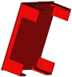 | Tapa posterior color rojo | [tapa-posterior-rojo.amf](../3D/amf/tapa-posterior-rojo.amf) | [tapa-posterior-rojo.stl](../3D/stl/tapa-posterior-rojo.stl) | [tapa-posterior-rojo.setp](../3D/step/tapa-posterior-rojo.step)|
|  | Caja color amarillo | [amarillo.amf](../3D/amf/amarillo.amf) | [amarillo.stl](../3D/stl/amarillo.stl) | [amarillo.setp](../3D/step/amarillo.step)|
| 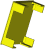 | Tapa posterior color amarillo | [tapa-posterior-amarillo.amf](../3D/amf/tapa-posterior-amarillo.amf) | [tapa-posterior-amarillo.stl](../3D/stl/tapa-posterior-amarillo.stl) | [tapa-posterior-amarillo.setp](../3D/step/tapa-posterior-amarillo.step)|
|  | Caja color verde | [verde.amf](../3D/amf/verde.amf) | [verde.stl](../3D/stl/verde.stl) | [verde.setp](../3D/step/verde.step)|
| 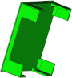 | Tapa posterior color verde | [tapa-posterior-verde.amf](../3D/amf/tapa-posterior-verde.amf) | [tapa-posterior-verde.stl](../3D/stl/tapa-posterior-verde.stl) | [tapa-posterior-verde.setp](../3D/step/tapa-posterior-verde.step)|
| 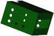 | Caja de sensores | [caja-sensores.amf](../3D/amf/caja-sensores.amf) | [caja-sensores.stl](../3D/stl/caja-sensores.stl) | [caja-sensores.setp](../3D/step/caja-sensores.step)|
| 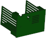 | Tapa posterior sensores | [tapa-posterior-sensores.amf](../3D/amf/tapa-posterior-sensores.amf) | [tapa-posterior-sensores.stl](../3D/stl/tapa-posterior-sensores.stl) | [tapa-posterior-sensores.setp](../3D/step/tapa-posterior-sensores.step)|
| 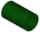 | Separador | [separador.amf](../3D/amf/separador.amf) | [separador.stl](../3D/stl/separador.stl) | [separador.setp](../3D/step/separador.step)|
| 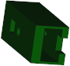 | Caja sensor CO2 | [caja-CCS811.amf](../3D/amf/caja-CCS811.amf) | [caja-CCS811.stl](../3D/stl/caja-CCS811.stl) | [caja-CCS811.setp](../3D/step/caja-CCS811.step)|
| 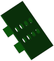 | Tapa caja sensor CO2 | [tapa-caja-CCS812.amf](../3D/amf/tapa-caja-CCS812.amf) | [tapa-caja-CCS812.stl](../3D/stl/tapa-caja-CCS812.stl) | [tapa-caja-CCS812.setp](../3D/step/tapa-caja-CCS812.step)|
|  | Soporte superior del tubo | [soporte-tubo-superior.amf](../3D/amf/soporte-tubo-superior.amf) | [soporte-tubo-superior.stl](../3D/stl/soporte-tubo-superior.stl) | [soporte-tubo-superior.setp](../3D/step/soporte-tubo-superior.step)|
| 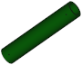 | Tubo | [tubo-200mm.amf](../3D/amf/tubo-200mm.amf) | [tubo-200mm.stl](../3D/stl/tubo-200mm.stl) | [tubo-200mm.setp](../3D/step/tubo-200mm.step)|
| 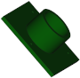 | Soporte inferior del tubo | [soporte-tubo-inferior.amf](../3D/amf/soporte-tubo-inferior.amf) | [soporte-tubo-inferior.stl](../3D/stl/soporte-tubo-inferior.stl) | [soporte-tubo-inferior.setp](../3D/step/soporte-tubo-inferior.step)|
| 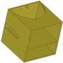 | Caja base | [base.amf](../3D/amf/base.amf) | [base.stl](../3D/stl/base.stl) | [base.setp](../3D/step/base.step)|
| 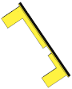 | Tapa posterior base | [tapa-posterior-base.amf](../3D/amf/tapa-posterior-base.amf) | [tapa-posterior-base.stl](../3D/stl/tapa-posterior-base.stl) | [tapa-posterior-base.setp](../3D/step/tapa-posterior-base.step)|

Podemos [descargar el archivo original de diseño FreeCAD](../3D/design/design.FCStd) y usarlo libremente bajo las condiciones de la licencia de este sitio.

También podemos [descargar todos los archivos](../3D/semaforo-3D.zip) en formato zip con las mismas condiciones citadas anteriormente.

El aspecto del semáforo lo vemos en la siguiente animación.

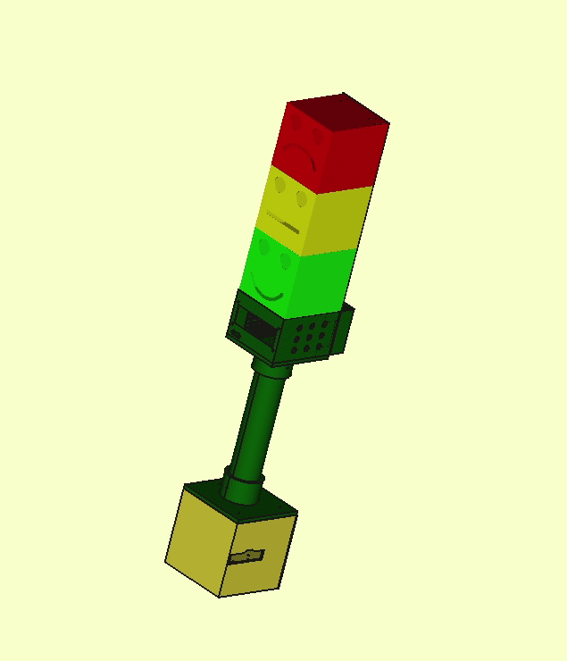

