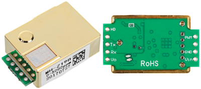
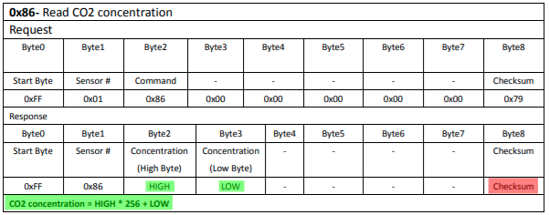
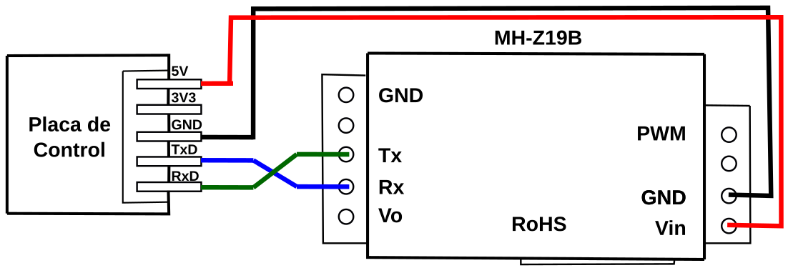
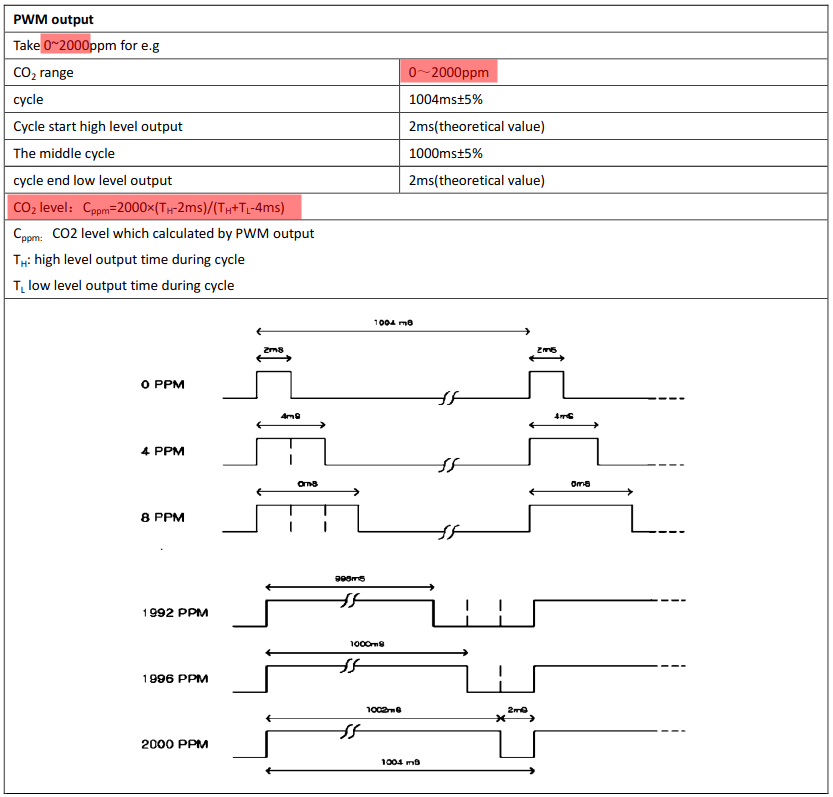
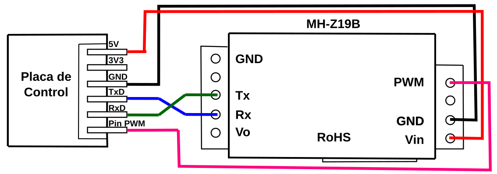

# El sensor MH-Z19B
Este sensor lo fabrica la empresa china [Winsen](https://www.winsen-sensor.com/), tiene el aspecto que vemos en la imagen 1 y aquí podemos obtener su [hoja de datos](https://www.winsen-sensor.com/d/files/infrared-gas-sensor/mh-z19b-co2-ver1_0.pdf).

| Imagen 1 |
|:-:|
|  |
| Aspecto del sensor MH-Z19B |

Este sensor es de los denominados **NDIR** (del inglés, Non Dispersive Infrared Detector), o sea que es un **sensor de infrarrojo no dispersivo**.

Los componentes principales de un sensor NDIR son una fuente de infrarrojos (lámpara), una cámara para la muestra o tubo de luz, un filtro de longitud de onda, y el detector de infrarrojos. El gas se difunde a la cámara de la muestra, y la concentración de gas se mide electroópticamente por la absorción de una determinada longitud de onda en el espectro infrarrojo (IR). La luz infrarroja se dirige cruzando la cámara de la muestra hacia el detector.

El sensor tiene dos modos de funcionamiento:

* Modo UART (Pines Tx y Rx), transmitiendo las lecturas de datos a través de un puerto serie a 9600 baudios.
* Modo PWM (Pin PWM), realizando cálculos a partir de los tiempos de estado alto y estado bajo de la señal PWM.

## Modo UART
Los valores genéricos para transmisión serie que nos muestra el datasheet son:

* Velocidad de transmisión: 9600 Baudios
* Bits de datos: 8
* Bits de parada: 1
* Paridad: 0 (ninguna)
  
Los comandos disponibles son:

* Lectura de la concentración de CO2: 0x86
* Calibración del punto cero (ZERO): 0x87
* Calibración del punto spam (SPAM): 0x88
* Activar/desactivar la autocalibración: 0x79
* Detección del rango de medida: 0x99

El sensor funciona de acuerdo con el siguiente principio: por via serie recibe comandos de nueve bytes (el último byte es el CRC o comprobación de redundancia cíclica) y también responde con paquetes de nueve bytes. En la imagen 2 observamos las indicaciones de la hoja de datos referentes a la medición de la concentración de CO2, que se realiza mediante el comando 0x86.

| Imagen 2 |
|:-:|
|  |
| Lectura via serie de la concentración de CO2 |

La conexión del sensor y la placa de control se realiza según vemos en la imagen 3 para trabajar con datos tipo TTL.

| Imagen 3 |
|:-:|
|  |
| Conexión del sensor para modo UART |

Según el datasheet la respuesta (concentración de CO2) se calcula con los bytes HIGH y LOW, pero aquí nos surge el primer problema y es que no sabemos el valor del Checksum o CRC porque, entre otras cosas, depende del resultado de esa lectura. Lo que si nos indica el datasheet es como hacer el cálculo del CRC, como veremos mas adelante.

## Modo PWM
Otra forma de obtener el nivel de CO2 es calcularlo a partir de la lectura del pin PWM mediante la ecuación indicada en la imagen 4. En este caso vemos que dicho cálculo depende aparentemente del rango de lectura del sensor, pero en el datasheet no se indica nada mas al respecto.

| Imagen 4 |
|:-:|
|  |
| Cálculo del nivel de CO2 a partir de la señal PWM |

Se puede escribir código para realizar el cálculo indicado. En la imagen 5 vemos la conexión completa del sensor ya incluida la conexión PWM.

 

| Imagen 5 |
|:-:|
|  |
| Conexión PWM |

## Análisis de los comando principales
En este apartado vamos a hablar de como trabajar con los comandos principales del sensor para poder analizar sus respuestas.

## Rango y checksum
En la tabla 2 del datasheet nos indica que el sensor puede tener dos rangos de medida, de 0 a 2000 ppm o de 0 a 5000 ppm, también nos indica la precisión y se indica que está compensado en temperatura.

El comando 0x99 explicado en el datasheet (imagen 5) nos indica como se detecta el rango del sensor y como se calcula el checksum o CRC (imagen 6). En este último caso incluso nos suministra un ejemplo de programa escrito en C para hacerlo.

 

| Imagen 5 |
|:-:|
|  |
| Rango del sensor |

Vemos como la respuesta está en los bytes 3 y 4 (HIGH y LOW) y nos indica como calcularlos. El byte HIGH se obtiene calculando la parte entera de la división y el byte LOW con el resto de la misma división, es decir:

* Para el caso de rango = 2000 tenemos que:

HIGH = 2000/256 = 7 en decimal = 0x07 en hexadecimal

LOW = Resto de 2000/256 = 208 en decimal = 0xd0 en hexadecimal.

Y esto no es otra cosa que 2000 expresado en hexadecimal.

* Para el caso de rango = 5000 tenemos que:

HIGH = 5000/256 = 19 en decimal = 0x13 en hexadecimal

LOW = Resto de 5000/256 = 136 en decimal = 0x88 en hexadecimal.

Y esto no es otra cosa que 5000 expresado en hexadecimal.

 

| Imagen 6 |
|:-:|
|  |
| Cálculo del checksum |

Vamos a comprobar el valor de checksum que se indica para el request de la imagen 2  procediendo según lo indicado en la imagen 6. 

* La suma de los bytes 1 a 7 es: 0x01 + 0x86 + 0x00 + 0x00 + 0x00 + 0x00 + 0x00 = 0x87
* La inversión u operación NOT es: 0xFF -0x87 = 0x78
* Finalmente el checksum es: 0x78 + 1 = 0x79

Con todo esto ya podemos saber el valor del noveno byte (byte8) correspondiente al checksum o CRC para cada rango en el comando de detección del rango (0x99). En la tabla siguiente lo vemos calculado.

| Rango | Suma de bytes 1 a 7 | Operación NOT | Checksum o CRC |
|---|:-:|:-:|:-:|
| 2000 | 0x01 + 0x99 + 0x07 + 0xD0 = 0x0171 | 0xFF - 0x0171 = 0x8E | **0x8E + 1 = 0x8F** |
| 5000 | 0x01 + 0x99 + 0x13 + 0x88 = 0x0135 | 0xFF - 0x0135 = 0xCA | **0xCA + 1 = 0xCB** |

 

| Imagen 1 |
|:-:|
|  |
| |

