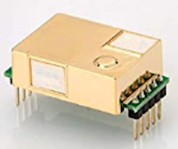

# Comparación sensores CO2 y eCO2
Vamos a realizar la comparativa entre un sensor eCO2 y un sensor de CO2 en base al video de Andreas Spiess [Reloj Cucú de CO2 para escuelas y empresas (no eCO2)](https://www.youtube.com/watch?v=hcPdZlpaRTo&feature=youtu.be) y la [Guía para ventilación en aulas](https://www.csic.es/sites/default/files/guia_para_ventilacion_en_aulas_csic-mesura.pdf) del Instituto de Diagnóstico Ambiental y Estudios del Agua, IDAEA-CSIC Mesura. Recomiendo encarecidamente ver ambos.

La citada guía, y la mayoría de referencias sobre el tema, establece los métodos de tratamiento de los datos de CO2 obtenidos y pone dos ejemplos de determinación de la concentración de CO2 objetivo en estado estable. Estos ejemplos resumen que:

* En aula de secundaria de 6.5x10x2.9 metros y una concentración de CO2 exterior se indica que valores superiores a 712 ppm de CO2 indican que la renovación del aire es inferior al objetivo ACH=5 y por tanto se requiere implementar medidas adicionales  o el desalojo del aula. Asumiendo un 20% de desviación como razonable nos iríamos a un valor de 855 ppm de CO2.
* Para un aula de primaria de 10x5x2.9 el resultado es de 665 ppm de CO2 que con el 20% se sitúa en 798 ppm de CO2.

***
*Nota: ACH son las siglas de Air Changes per Hour y hace referencia a la renovación de aire por hora significando que si una sala tiene 1 ACH entra en el mismo un volumen de aire exterior igual al volumen de la sala significando, con la mezcla continua de aire, que el 63% del aire interior ha sido reemplazado. Con 2 ACH se reemplaza el 86% y con 3 ACH el 95%. La guía de Harvard recomienda de 5 a 6 renovaciones de aire por hora para aulas de 100 m2 con 25 estudiantes de infantil. En la imagen 1 vemos la clasificación ACH*

| Imagen 1 |
|:-:|
|  |
| Niveles ACH |

***

Vemos que siempre se hace referencia a CO2 y en cambio nuestro sensor CCS811 es un sensor de eCO2 o CO2 equivalente. Es decir, nuestro sensor en realidad detecta una amplia gama de compuestos volátiles orgánicos (VOC) entre los que se incluye el nivel equivalente de CO2.

Entonces ¿cuales son las diferencias entre sensores de CO2 y de eCO2?. Hay varias:
1. El precio suele ser bastante indicativo pues los sensores de CO2 son bastante más caros que los de eCO2. En la imagen 2 vemos una comparativa.

| Imagen 2a | Imagen 2b |
|:-:|:-:|
|  |  |
| Precio sensor eCO2 | Precio sensor profesional CO2 |

2. Las variaciones en las medidas de los sensores de eCO2 son mucho mayores que en los de CO2. En la imagen 3 vemos la comparativa de mediciones de varios días com ambos.

| Imagen 3 |
|:-:|
|  |
| Comparativa medidas sensor CO2 y eCO2 |

Podemos observar como hay veces que el sensor de eCO2 sigue las variaciones del de CO2 pero hay veces que se producen grandes cambios en el de eCO2 que, a través de la comparativa, es claro que no son cambios tan altos en el dióxido de carbono sino en algún otro VOC.

Por lo tanto la sugerencia es usar sensores profesionales de CO2 para nuestro proyecto, cosa que haremos en algunas otras versiones.

Va a ser conveniente por lo tanto desechar sensores como el CCS811, el SGP30 o el BME680.

Es conveniente usar sensores NDIR (Non Dispersive InfraRed) en los que el CO2 bloquea la luz en una longitud de onda de unos 4.26 $\mu$m.

Un aspecto importante de los sensores de CO2 es la precisión, por lo que debemos calibrarlos de forma asidua. Hay un aspecto clave y es que la concentración de CO2 es de 410 ppm a nivel del mar y se reduce un 3% con cada 300 metro de altitud.

El sensor MH-Z19 Chino que vemos en la imagen 4 no dispone de calibración automática.

| Imagen 4 |
|:-:|
|  |
| Sensor MH-Z19 |

El sensor MH-Z19B es la versión con calibración automática del anterior y lo vemos en la imagen 5.

| Imagen 5 |
|:-:|
|  |
| Sensor MH-Z19B |

Finalmente otra opción es el sensor SCD30 de Sensirion con conexión I2C que vemos en la imagen 6. Este sensor también se autocalibra.

| Imagen 6 |
|:-:|
|  |
| Sensor SCD30 |

También son muy interesantes los basados en el efecto fotoacústico, como el SCD40 de Sensirion con conexión I2C pero no los vamos a tratar aquí, aún no es comercial.

