# Firmware para la versión modular

***

**Pendiente de calibrar en espacio físico real**

***

Antes de nada indicaremos que la programación del sistema la vamos a realizar con [ArduinoBlocks](http://www.arduinoblocks.com/), un sistema de programación por bloques online que nos permite tener aplicaciones muy eficientes de forma rápida y sencilla.

El programa lo tenemos [disponible](http://www.arduinoblocks.com/web/project/320611) para ponerlo entre nuestros proyectos.

Una vez entre nuestros proyectos podemos acceder a la información del mismo (imagen 1) donde se describe brevemente en que consiste y se da un listado del material utilizado con enlaces a las wikis de los distintos componentes.

| Imagen 1 |
|:-:|
| 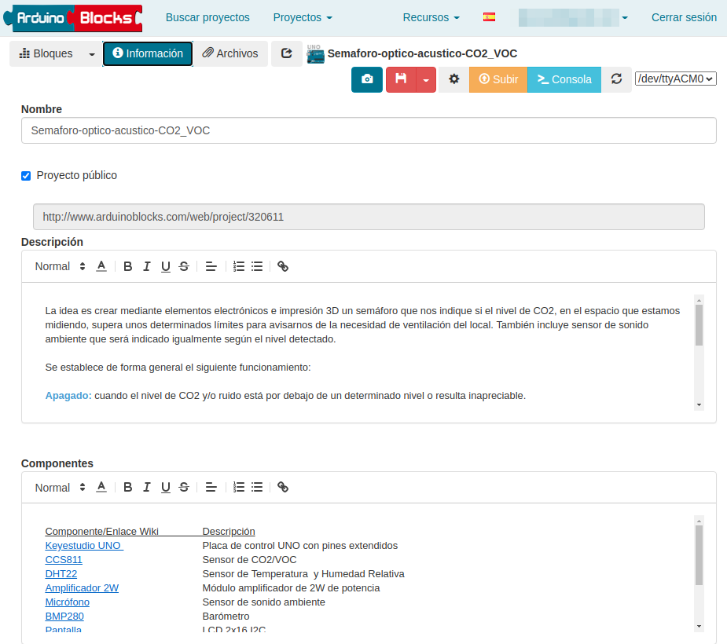 |
| Información del proyecto |

## Inicializar

El programa básicamente se estructura por funciones que son llamadas cuando necesitamos de ellas. Vamos a ir describiendo su constitución. Comenzamos con el bloque *"Inicializar"* que vemos en la imagen 2. Se inicializa la LCD, se activa su retroiluminación, se borra cualquier contenido en la misma y se crean los cuatro caracteres especiales siguientes: 1 para º, 2, 3 y 4 para las letras acentuadas á, ó y ú. Finalmente se hace llamada a las dos funciones que describimos seguidamente. 

| Imagen 2 |
|:-:|
| 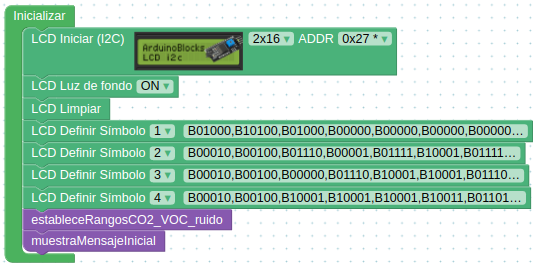 |
| Inicializar |

## Función *estableceRangosCO2_VOC_ruido*

Corresponde a la imagen 3 y es donde se establecen los rangos de valores de CO2 ([Valores recomendados](http://127.0.0.1:8000/sobre-co2/co2/#valores-de-referencia-para-el-co2)), VOC ([Valores recomendados](http://127.0.0.1:8000/sobre-co2/co2/#valores-de-referencia-para-voc)) y ruido para activar los distintos estados del semáforo. Aquí será donde debemos colocar los valores de calibración según nuestra realidad.

| Imagen 3 |
|:-:|
| 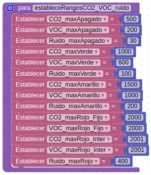 |
| Rangos |

Esta función solamente es llamada en la inicialización por lo que los valores de las variables se establecen cuando se inicia el sistema.

## Función *"muestraMensajeInicial"*

La función que vemos en la imagen 4 se destina a mostrar unos mensajes de bienvenida y hacer que, en un bucle que se repite dos veces, se enciendan de forma consecutiva los tres colores siguiendo la secuencia verde-amarillo-rojo. Servirá por tanto de testeo de la LCD y de los tres diodos.

| Imagen 4 |
|:-:|
| 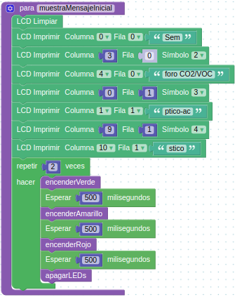 |
| Mensaje inicial |

Esta función solamente es llamada en la inicialización por lo que el mensaje y el testeo de LEDs solamente se ejecuta cuando se inicia el sistema.

Antes de entrar en la descripción del funcionamiento del bucle vamos a describir el resto de funciones.

## Funciones de control de los LEDs

Se trata de cuatro sencillas funciones consistentes en: 

* Apagar todos los LEDs
* Encender el LED del color verde y mantener apagados los otros dos
* Encender el LED del color amarillo y mantener apagados los otros dos
* Encender el LED del color rojo y mantener apagados los otros dos

En la imagen 5 podemos ver estas funciones.

| Imagen 5 |
|:-:|
| 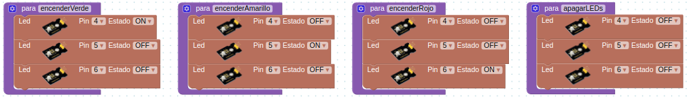 |
| Estado de los LEDs |

## Funciones mostrar datos

Son las funciones encargadas de mostrar en la LCD los valores de lectura de los diferentes sensores y que vamos a ver como es cada una de ellas.

* mostrarTyHR. Función que se encarga de tomar lectura del sensor DHT22 y mostrar los resultados de temperatura en grados centigrados y humedad relativa en porcentaje. En la imagen 6 vemos como está configurada.

| Imagen 6 |
|:-:|
| 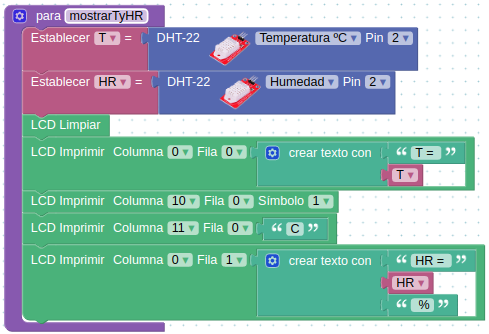 |
| Mostrar T y HR |

* mostrarBarometro. Función que se encarga de tomar lectura del sensor BMP280 y mostrar los resultados de presión atmosférica en milibares y altitud sobre el nivel del mar en metros. En la imagen 7 vemos como está configurada.

| Imagen 7 |
|:-:|
| 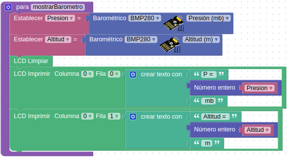 |
| Mostrar presión atmosférica y altitud |

* mostrarCO2. Función que se encarga de tomar lectura del sensor CCS811 y mostrar los niveles de CO2 en ppm y $\mu$g/m$^3$. En la imagen 8 vemos como está configurada.

| Imagen 8 |
|:-:|
|  |
| Mostrar niveles de CO2 |

* mostrarVOC. Función que se encarga de tomar lectura del sensor CCS811 y mostrar los niveles de VOC en ppb. En la imagen 9 vemos como está configurada.

| Imagen 9 |
|:-:|
|  |
| Mostrar niveles de VOC |

* mostrarRuido. Función que se encarga de tomar lectura analógica del sensor de sonido y mostrar su valor que estará comprendido entre 0 y 1023. En esta función se incluye una sentencia condicional que pregunta por el estado del interruptor de modo. Si está en la posición de activado sonará el tema principal de Star Wars y si está en posición desactivado no sonará nada. En la imagen 10 vemos como está configurada.

| Imagen 10 |
|:-:|
| 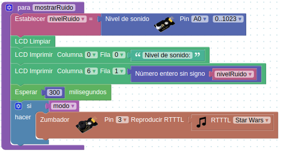 |
| Mostrar nivel sonoro |

## Funciones mostrar mensajes

Las funciones que vemos en la imagen 11 simplemente se encargan de mostrar los mensajes determinados en cada una de ellas cuando son invocadas.

| Imagen 11 |
|:-:|
| 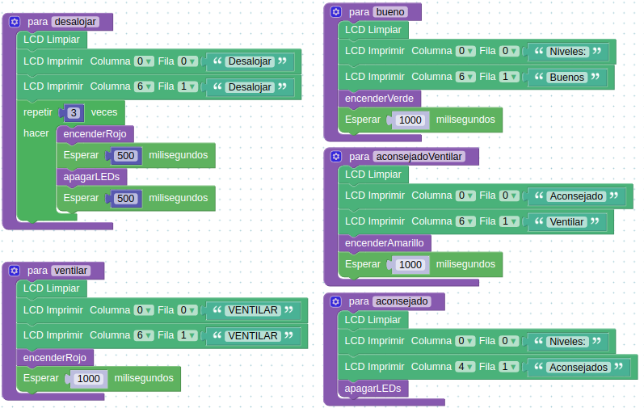 |
| Mostrar mensajes |

## Funciones calcular niveles

Estas funciones se destinan a asignar un valor entero a los rangos de valores establecidos en la función estableceRangosCO2_VOC_ruido. Su finalidad es simplificar las sentencias condicionales del bucle principal.

* calcularNivelCO2

Se trata de asignar un número a los distintos rangos de CO2 establecidos mediante una función que va a realizar el cálculo para devolver el valor numérico correspondiente al nivel de CO2, tal y como vemos en la imagen 12. el valor *nivelCO2* devuelto será alguno de los mostrados en la tabla siguiente:

| Valor devuelto  nivelCO2  | Se dará cuando |
|:-:|---|
| 0 | El valor obtenido para la variable CO2(ppm) sea menor o igual que el valor asignado a CO2_maxApagado |
| 1 |El valor obtenido para la variable CO2(ppm) sea mayor que el valor asignado a CO2_maxApagado y menor o igual que CO2_maxVerde |
| 2 |El valor obtenido para la variable CO2(ppm) sea mayor que el valor asignado a CO2_maxVerde y menor o igual que CO2_maxAmarillo |
| 3 |El valor obtenido para la variable CO2(ppm) sea mayor que el valor asignado a CO2_maxAmarillo y menor o igual que CO2_maxRojoFijo |
| 4 | Si no se cumple ninguna de las condiciones anteriores es porque se ha superado el valor de CO2(ppm) de 2001 |

| Imagen 12 |
|:-:|
| 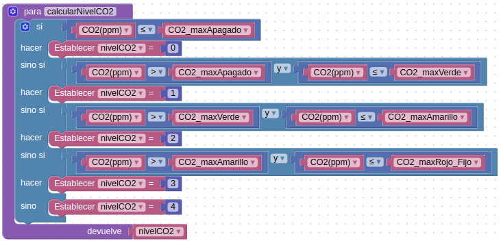 |
| Función calcularNivelCO2 |

* calcularNivelVOC

Se trata de asignar un número a los distintos rangos de VOC establecidos mediante una función que va a realizar el cálculo para devolver el valor numérico correspondiente al nivel de VOC, tal y como vemos en la imagen 13. el valor *nivelVOC* devuelto será alguno de los mostrados en la tabla siguiente:

| Valor devuelto  nivelVOC  | Se dará cuando |
|:-:|---|
| 0 | El valor obtenido para la variable VOC(ppb) sea menor o igual que el valor asignado a VOC_maxApagado |
| 1 |El valor obtenido para la variable VOC(ppb) sea mayor que el valor asignado a VOC_maxApagado y menor o igual que VOC_maxVerde |
| 2 |El valor obtenido para la variable VOC(ppb) sea mayor que el valor asignado a VOC_maxVerde y menor o igual que VOC_maxAmarillo |
| 3 |El valor obtenido para la variable VOC(ppb) sea mayor que el valor asignado a VOC_maxAmarillo y menor o igual que VOC_maxRojoFijo |
| 4 | Si no se cumple ninguna de las condiciones anteriores es porque se ha superado el valor de VOC(ppb) de 2001 |

| Imagen 13 |
|:-:|
|  |
| Función calcularNivelVOC |

* calcularNivelSonido

Se trata de asignar un número a los distintos rangos de nivel de ruido establecidos mediante una función que va a realizar el cálculo para devolver el valor numérico correspondiente al nivel sonoro, tal y como vemos en la imagen 14. el valor *nivelSonoro* devuelto será alguno de los mostrados en la tabla siguiente:

| Valor devuelto  nivelSonoro  | Se dará cuando |
|:-:|---|
| 0 | El valor obtenido para la variable *nivelRuido* sea menor o igual que el valor asignado a Ruido_maxApagado |
| 1 |El valor obtenido para la variable *nivelRuido* sea mayor que el valor asignado a Ruido_maxApagado y menor o igual que Ruido_maxVerde |
| 2 |El valor obtenido para la variable *nivelRuido* sea mayor que el valor asignado a Ruido_maxVerde y menor o igual que Ruido_maxAmarillo |
| 3 |Si no se cumple ninguna de las condiciones anteriores es porque se ha superado el valor máximo de *nivelRuido* establecido en la variable *Ruido_maxRojo* |

| Imagen 14 |
|:-:|
| 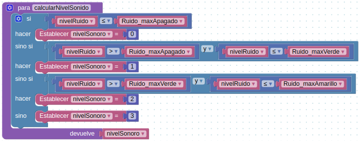 |
| Función calcularNivelSonido |

## Bucle principal

En la imagen 15 vemos la parte inicial del bucle que comienza con la lectura de la posición del conmutador de *modo* para determinar si se reproducen sonidos o no. A continuación se invocan las funciones que vemos y se van mostrando los distintos valores cada 1.5 segundos. Una vez finalizada la muestra de valores se procede a averiguar el rango en el que está el CO2, el VOC y el Sonido invocando a las funciones correspondientes y asegurando que el valor devuelto es un número entero positivo. 

| Imagen 15 |
|:-:|
| 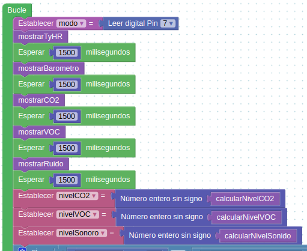 |
| Muestra de valores y calculo de rangos |

Una vez establecido el rango las sentencias condicionales siguientes lo que hacen es determinar en cual de ellos se está estableciendo la condición para CO2 o VOC o Ruido.

* nivelCO2 = 4 o nivelVOC = 4 o nivelSonoro = 3

Esto lo vemos en la imagen 16 y si se cumple que estamos en ese rango para cualquiera de las variables de ejecutará 5 veces un bucle en el que se muestran los niveles de CO2 y VOC y el mensaje **Desalojar**. Si el sonido está activado se emiten pitidos.

| Imagen 16 |
|:-:|
| 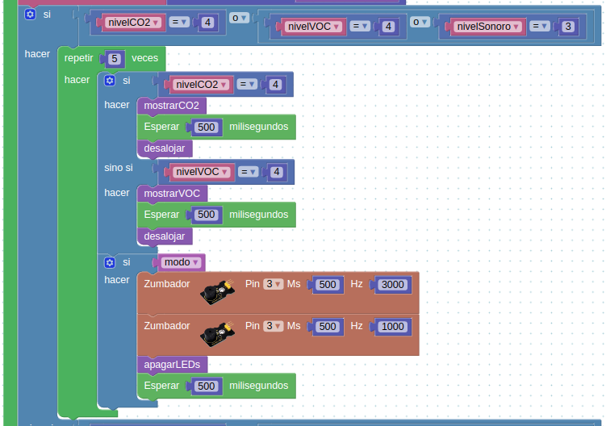 |
| Valores para desalojar |

* nivelCO2 = 3 o nivelVOC = 3 o nivelSonoro = 3

Si no se cumple la condición anterior se pregunta esta otra que vemos en la imagen 17 y si se cumple que estamos en ese rango para cualquiera de las variables de ejecutará 3 veces un bucle en el que se muestran los niveles de CO2 y VOC y el mensaje **VENTILAR**. Si el sonido está activado se emiten pitidos.

| Imagen 17 |
|:-:|
| 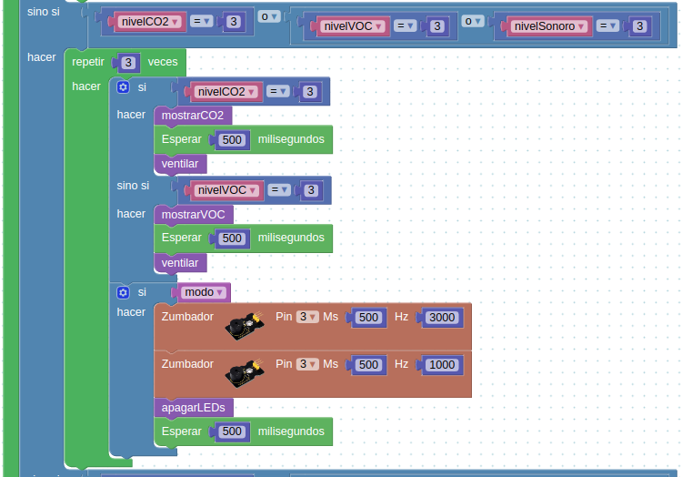 |
| Valores para ventilar |

* nivelCO2 = 2 o nivelVOC = 2 o nivelSonoro = 2

Si no se cumple la condición anterior se pregunta esta otra que vemos en la imagen 18 y si se cumple que estamos en ese rango para cualquiera de las variables de ejecutará 2 veces un bucle en el que se muestran los niveles de CO2 y VOC y el mensaje **Aconsejado Ventilar**. Si el sonido está activado se emite la melodía de Indiana Jones. 

| Imagen 18 |
|:-:|
| 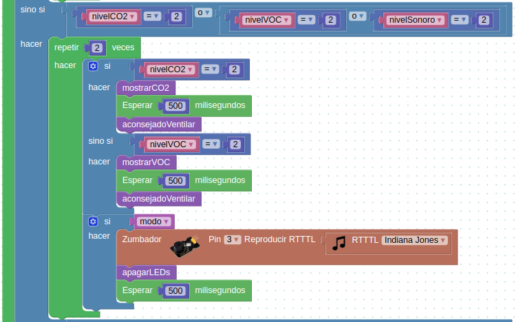 |
| Valores para aconsejado ventilar |

* nivelCO2 = 1 o nivelVOC = 1 o nivelSonoro = 1 o no se cumple ninguna condición

Si no se cumple la condición anterior se pregunta esta otra que vemos en la imagen 19 y si se cumple que estamos en ese rango para cualquiera de las variables de ejecutará 1 vez un bucle en el que se muestran los niveles de CO2 y VOC y el mensaje **Niveles Buenos**. Si el sonido está activado se emite la melodía de Super Mario. Si no se cumple esta condición, y por tanto ninguna de las anteriores, se ejecuta la parte *sino* que lógicamente corresponde a la situación deseable que consiste en que los LEDs permanezcan apagados, se muestre el mensaje **Niveles Aconsejados** y no se emita ningún sonido aunque este esté activado.

| Imagen 19 |
|:-:|
| 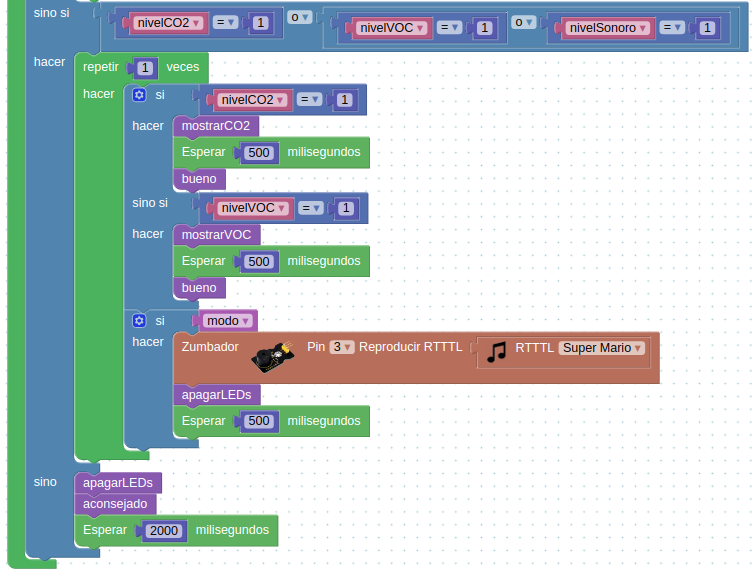 |
| Valores para niveles buenos y aconsejados |

