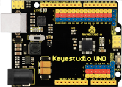

# Versión modular

Se trata de la versión dirigida a usuarios con cierta experiencia en trabajo con placas tipo Arduino y sensores diversos.

La opción adoptada permite el cableado del equipo final sin necesidad de utilizar placas breadboard al usar la placa UNO con pines extendidos de Keyestudio y que todos los sensores disponen de conexiones de pines tipo dupont.

A continuación tenemos una tabla a modo de lista de materiales gráfica con enlaces a sitios de compra.

| Cantidad | Descripción | Imagen |
|:-:|---|:-:|
| 1 |keyestudio UNO con inteface de pines extendidos |  |
| 1 | Placa de conversión tipo HUB I2C |  |
| 1 | Sensor de Dioxido de Carbono |  |
| 1 | Sensor de temperatura y humedad relativa |  |
| 1 | Amplificador de 2W de potencia|  |
| 1 | Micrófono sensor de sonido ambiente |  |
| 1 | Barómetro BMP280|  |
| 1 | Pantalla LCD 1602 I2C |  |
| 3 | LED de 3W |  |
| 1 | Alimentador Arduino 12V - 2A |  |
| 1 | Interruptor de panel deslizante 1P2T SPDT de 0.5A 50V CC |  |
| 1 | Cables tipo dupont H-H de 10 cm y 4 pines|  |
| 4 | Cable tipo dupont H-H de 30 cm y 3 pines|  |
| 3 | Cable tipo dupont H-H de 30 cm y 4 pines|  |
| 1 | Cable tipo dupont H-H de 30 cm y 5 pines|  |
| 1 | Cable tipo dupont H-H de 40 cm y 3 pines|  |
| 1 | Cable tipo dupont H-H de 45 cm y 3 pines|  |
| 1 | Cable tipo dupont H-H de 50 cm y 3 pines|  |
| 1 | **OPCIONAL** Shield WiFi ESP01 |  |
| 1 | **OPCIONAL** Módulo ESP8266 WiFi ESP01 |  |

