# Montaje y conexionado de la versión modular

## Paso 1: Base inicial

Comenzaremos por la base, sujetando el Arduino UNO y el HUB USB. Los elementos necesarios son:

* La base que vemos en la imagen 1a y las placas de la imagen 1b.

| Imagen 1a | Imagen 1b |
|:-:|:-:|
| 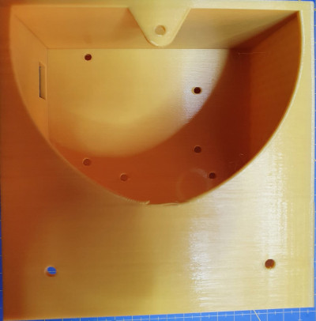 | 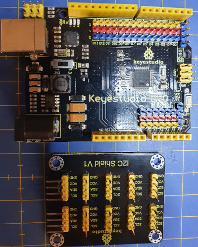 |
| Base | Arduino UNO y HUB I2C |

* Tornillos M3 x 10mm, tuercas M3 y 4 cables dupont H-H de 10cm de longitud. Estos elementos los vemos en la imagen 2a y 2b.

| Imagen 2a | Imagen 2b |
|:-:|:-:|
| 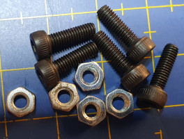 | 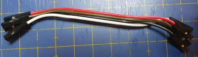 |
| Tornillos y tuercas | Cables dupont H-H |

Sujetamos la placa Arduino con 3 tornillos y el HUB I2C con dos en diagonal. Es importante, aunque puede plantear un poco de dificultad, que el Arduino quede bien sujeto para evitar problemas cuando conectemos el alimentador o el USB. En la imagen 3 podemos ver el aspecto tras sujetar las placas.

| Imagen 3 |
|:-:|
| 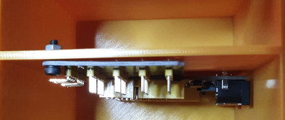 |
| Placas Arduino y HUB I2C atornilladas a la base |

Para acabar esta etapa vamos a conectar con 4 cables dupont de 10cm de longitud los pines I2C macho del Arduino a uno de los pines acodados del HUB I2C teniendo especial cuidado en que el orden de conexión sea el mismo en ambas placas. En la imagen 4 vemos como queda la base al final de esta etapa.

| Imagen 4 |
|:-:|
| 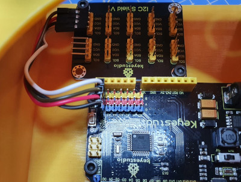 |
| Base finalizada en la etapa inicial |

Por ahora reservamos la base.

## Paso 2: Caja de sensores inicial

En la caja de sensores van alojados la LCD y el interruptor deslizante.

Vamos a necesitar el siguiente material:

* Caja sensores impresa en 3D como la de la imagen 5.

| Imagen 5 |
|:-:|
| 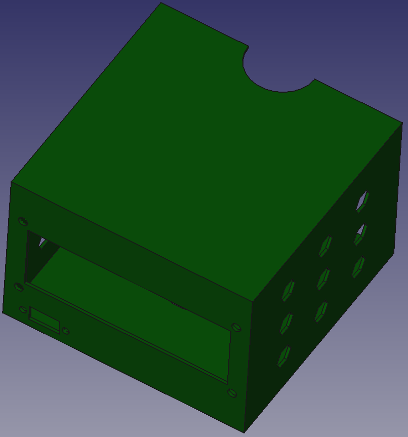 |
| Caja de sensores |

* Interruptor deslizante preparado con tres cables terminados en conector dupont hembra de unos 30 cm de longitud, lo vemos en la imagen 6a, tornillos M3x10 con tuercas M3 y tornillos de rosca chapa de 3x5mm, como vemos en la imagen 6b.

| Imagen 6a | Imagen 6b |
|:-:|:-:|
| 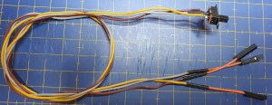 |  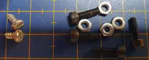 |
| Interruptor preparado con tres cables | Tornilleria |

Colocamos cuatro conectores dupont H-H en los terminales I2C de la LCD y doblamos, con mucho cuidado para no romper nada, los pines unos 45 grados y sujetamos la LCD en su posición con los 4 tornillos M3x10, debiendo quedar un aspecto similar al de la imagen 7. Ofrece cierta dificultad colocar las tuercas en su lugar pero con algo de maña y la ayuda de pinzas o alicates se consigue sin demasiado esfuerzo.

| Imagen 7 |
|:-:|
| 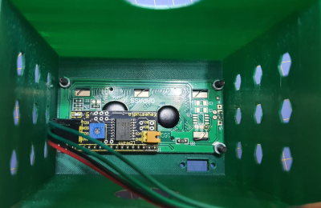 |
| LCD colocada en su alojamiento |

En mi caso que aprovechado cables de conexión de motores de imprsoras 3D de 3 hilos para con 1 conector de 3 hilos y un cable de otro constituir el cable de 4 hilos necesario.

Finalmente pasamos los cables del interruptor por el orificio, lo colocamos en su lugar y lo atornillamos, quedando el aspecto final que vemos en la imagen 8.

| Imagen 8 |
|:-:|
| 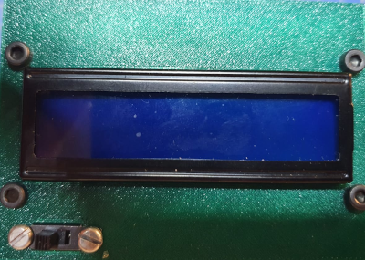 |
| Caja de sensores con LCD e interruptor colocados |

## Paso 3: Pie y soportes inferior y superior

Vamos a realizar el montaje de las tres piezas que vemos en la imagen 9 que servirán para dar altura a los colores desde la base. Estas partes no llevan ningún componente, el pie es un tubo que permite pasar los cables desde la parte superior (sensores y luces) a la base donde está alojada la placa UNO. Solamente necesitamos las tres piezas y cuatro tornillos M3x10 para sujetar el tubo a los soportes. Si queremos también lo podemos pegar, pero se aconseja poner los tornillo para que sirvan de guía y las plataformas de soporte que en la posición correcta.

| Imagen 9 |
|:-:|
| 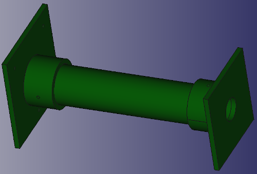 |
| Pie y soportes |

## Paso 4: Paso 3 mas caja de sensores

Pasamos los cables por el tubo y vamos a proceder a etiquetarlos para que al final resulte lo mas sencillo posible conectarlos a las placas de la base. Voy a mostrar como lo hago, pero cada cual tendrá que adaptar esto a sus propios elementos.

| Sensor | Rojo | Negro | Verde | Verde anudado | Amarillo | Gris | Marrón |
|:-:|:-:|:-:|:-:|:-:|:-:|:-:|:-:|
| LCD | GND | VCC | SDA | SCL | - | - | - |
| Interruptor| - | - | - | - | Posición izquierda | Cursor | Posición derecha |

Cada grupo de conectores va etiquetado con un trozo de cinta de carrocero mas su identificador.

Una vez estemos en la situación anterior vamos a proceder a pegar la caja de sensores al soporte superior (el más pequeño), para lo que utilizaremos preferentemente un pegamento especial para plásticos rígido o PVC. Debemos asegurarnos que la LCD queda mirando al frente, lo que es fácil de ver dado que la orientación del conjunto queda con los tornillos de sujeción a 90º desde el frente y la parte posterior de la base inferior es la que lleva un solo orificio para atornillar. En la imagen 10 podemos ver el aspecto de lo que llevamos de montaje.

| Imagen 10 |
|:-:|
| 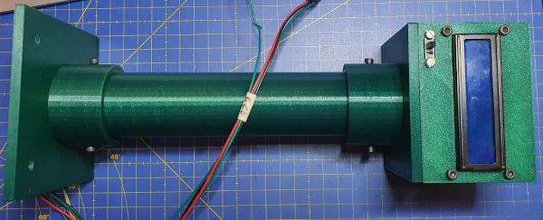 |
| Pie con soportes y caja sensores |

## Paso 5: Tapa posterior sensores

En la pieza impresa que vemos en la imagen 11 es donde van alojados la mayoría de los sensores que colocaremos como vamos a explicar seguidamente.

| Imagen 11 |
|:-:|
| 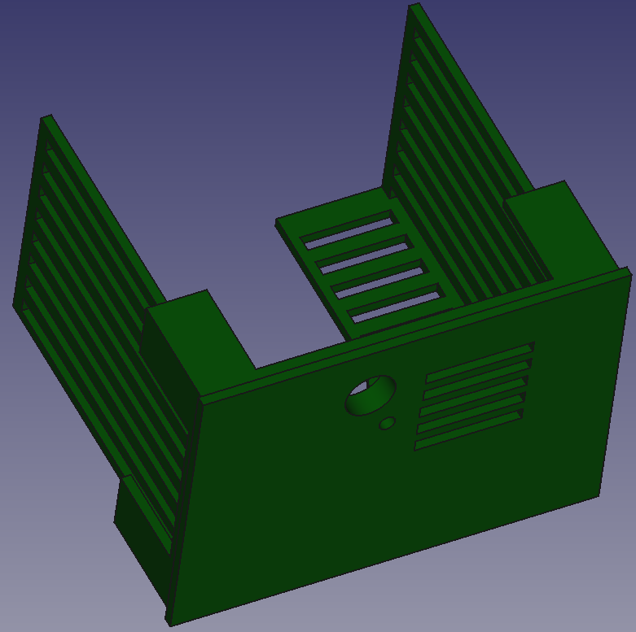 |
| Tapa posterior sensores |

Los elementos que vamos a montar son los que vemos en la imagen 12, es decir, el amplificador, el micrófono, el sensor de temperatura y humedad, el barómetro, el sensor de CO2  y la antena WiFi con su shield.

| Imagen 12 |
|:-:|
| 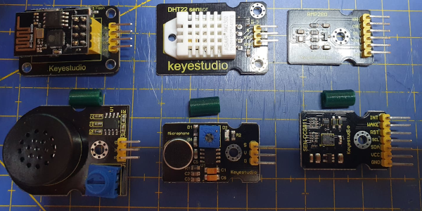 |
| Elementos a montar en la tapa posterior de la caja de sensores |

Antes de colocar el sensor BMP280 en su lugar, y con el fin de pasar un cable mas por el tubo, he recurrido al *ñapometro* para solucionar un pequeño detalle a tener en cuenta con el BMP280, la dirección del bus cambia según el estado lógico del pin SDO, y si se deja desconectado la dirección queda indeterminada, por lo que puede parecer que no funciona correctamente. Las direcciones físicas de este dispositivo I2C son:

`SDO=GND -> I2C Address (0x76)`

`SDO=3.3V -> I2C Address (0x77)`

En la librería desarrollada por Adafruit, el bus I2C utiliza por defecto la dirección (0x77) por lo que debemos conectar el pin SDO a Vcc. En la imagen siguiente se puede apreciar un detalle de la ñapa realizada en este caso sobre la propia PCB con un trocito de hilo rígido.

|Ñapa en el BMP280 |
|:-:|
| 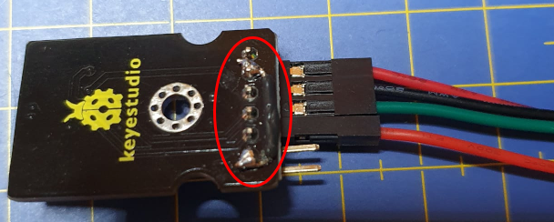 |
| Detalle de la ñapa realizada |

Vamos a necesitar también 3 separadores de 10mm de longitud, 4 tornillos M3x10mm, 3 tornillos M3x20mm y 7 tuercas M3. Sujetamos cada sensor en la posición que se observa en la imagen 13 utilizando los separadores y los tornillos de 20mm para el amplificador, el micrófono y el sensor de CO2 evitando así que queden pegados a las paredes de la caja.

| Imagen 13 |
|:-:|
| 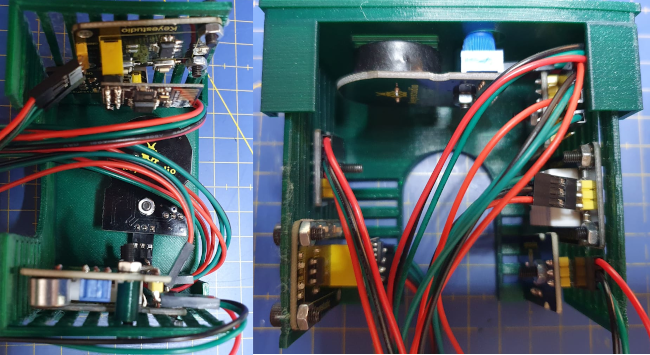 |
| Aspecto de la tapa posterior de la caja de sensores montada |

Pasamos todos los cables hacía la base etiquetando adecuadamente cada conjunto de forma similar a la mostrada anteriormente. Comprobamos visualmente que todos los conectores están colocados en su lugar y probamos que la tapa encaja en la caja, aunque aún no la cerramos del todo pues debemos pasar los cables de los diodos LEDs. En las imágenes 14a y 14b podemos ver su aspecto en el estado actual de montaje.

| Imagen 14a | Imagen 14b |
|:-:|:-:|
| 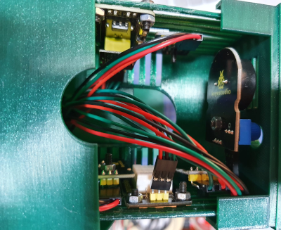 |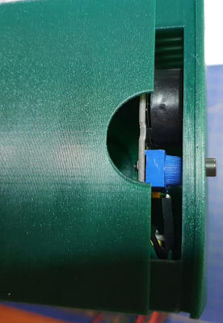 |
|  |

El etiquetado de los cables queda, en mi caso, de la siguiente forma:

| Sensor | Rojo | Negro | Verde | Rojo anudado | Verde anudado |
|:-:|:-:|:-:|:-:|:-:|:-:|
| Amplificador | GND | VCC | Señal | - | - |
| CO2| GND | VCC | SDA | SCL | WAKE |
| Micrófono | GND | VCC | Señal | - | - |
| DHT22 | GND | VCC | Señal | - | - |
| Barómetro| GND | VCC | SDA | SCL | - |
| WiFi | GND | VCC | Tx | - | Rx | 

Reservamos el conjunto montado hasta el momento.

## Paso 6: Colores y LEDs

Vamos a montar cada uno de los colores del semáforo, para lo que vamos a necesitar los cubos verde, amarillo y rojo, tres LEDs de 3W y tres cables de 3 conectores tipo dupont H-H de 40cm para el verde, 45cm para el amarillo y 50cm para el rojo. En la imagen 15 vemos una captura de los cubos de colorees y en la 16 vemos el aspecto de los cables con el diodo conectado.

| Imagen 15 |
|:-:|
| 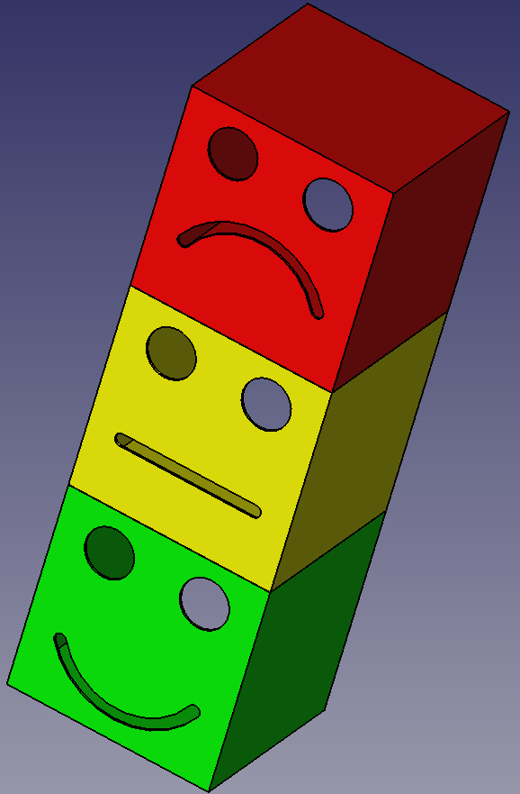 |
| Colores |

| Imagen 16 |
|:-:|
| 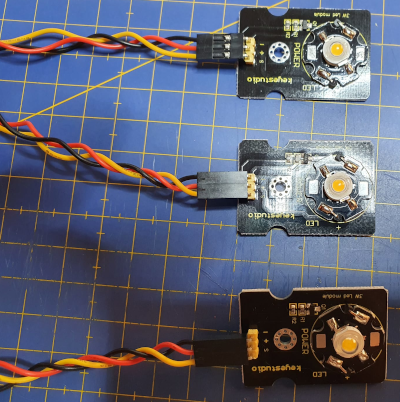 |
| Diodos LED con cables |

Pasamos los cables por el tubo conectado a la caja de sensores para llevarlos a la base. Los cables de los LEDs pasan de un cubo de color a otro aprovechando el hueco en forma semicírculo que tienen las piezas.

Pegamos cada cubo de color en su posición teniendo especial cuidado de que los gestos queden orientados correctamente. El aspecto que tendrá el conjunto será algo similar al que vemos en la imagen 17.

| Imagen 17 |
|:-:|
| 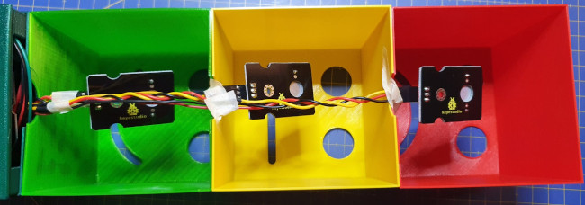 |
| Cubos pegados en su posición con su LED |

Como todo está conectado ya podemos proceder a colocar todas las tapas de los elementos finalizados hasta el momento. En la imagen 18 vemos el aspecto de la parte posterior del semáforo.

| Imagen 18 |
|:-:|
| 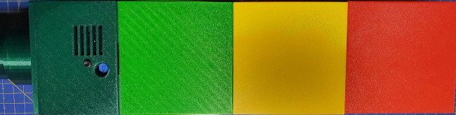 |
| Parte posterior del semáforo |

En el caso de los LEDs la tabla de colores es muy sencilla, pues solamente llevan tres hilos y son todos iguales. En la tabla siguiente se explicita.

| LED | Rojo | Negro | Amarillo |
|:-:|:-:|:-:|:-:|
| Rojo,Verde y Amarillo | VCC | GND | Señal |

## Paso 7: Conexión de todos los elementos

El siguiente paso en proceder al conexionado de los cables que vemos en la imagen 19 en sus pines correspondientes.

| Imagen 19 |
|:-:|
| 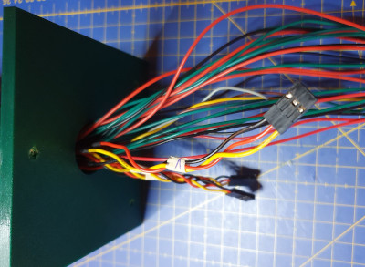 |
| Cables listos para conectar |

En la imagen 20 tenemos la guía de conexionado o pinout que también podemos descargar de los siguientes enlace: [formato fuente svg](../modular/pinout/Ks0172-keyestudio-UNO.svg), [formato png](../modular/pinout/Ks0172-keyestudio-UNO.png) y [formato pdf](../modular/pinout/Ks0172-keyestudio-UNO.pdf). El pinout junto con el etiquetado de cables que hemos ido creando nor permitirá realizar todas las conexiones.

| Imagen 20 |
|:-:|
| 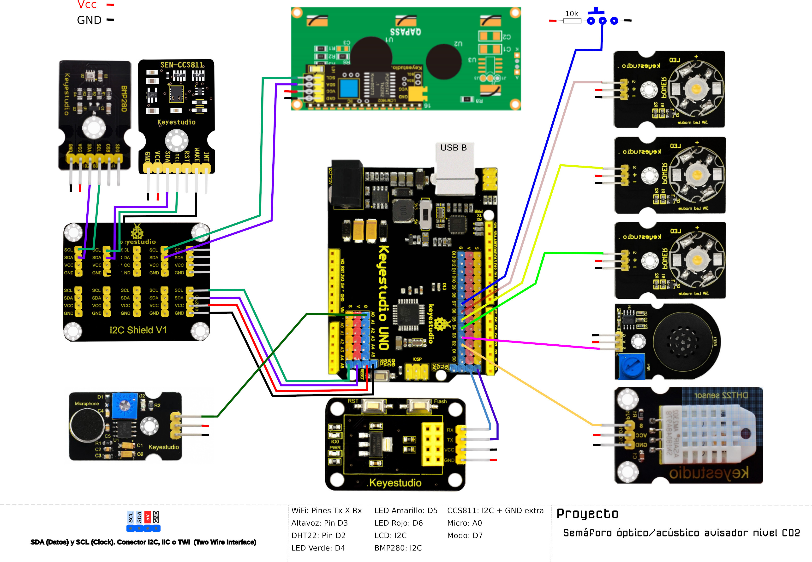 |
| Pinout |

Recuperamos la base y vamos conectando los conectores en sus respectivas posiciones según la guía de la imagen 20 procurando, si sobra mucho cable que quede dentro del tubo.

En este momento vamos a indicar que el extremo amarillo del interruptor es el que lleva alojada la resistencia de 10k que podemos observar en la imagen 20. Este será el terminal que va conectado a positivo y por tanto corresponderá a nivel alto en el modo de selección y, lógicamente el terminal marrón irá conectado a GND y se corresponderá con el nivel bajo en el modo de selección. En la imagen 21 vemos un detalle de la colocación de la resistencia antes y después de calentar la funda termoretractil.

| Imagen 21a | Imagen 21b |
|:-:|:-:|
| 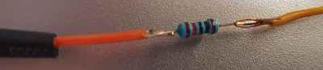 | 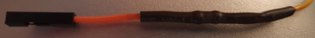 |
| Detalle resistencia de 10k | Aspecto final del cable con la resistencia |

