# Pruebas básicas sensores y actuadores

Antes de entrar en un firmware de todo el sistema estimo conveniente tener a mano pequeños programas que permitan ir probando los distintos elementos según los vamos conectando y que también pueden servir para descartar fallos en posibles averías si se producen.

Vamos a realizar las pruebas utilizando la programación por bloques de ArduinoBlocks y dejaremos enlaces a los programas para cargarlos directamente en la plataforma asi como los códigos `.ino`y las librerías utilizadas para que podamos trabajar de la forma que mas nos guste.

## Prueba de la LCD I2C

Conectamos la LCD en cualquiera de los bloques de 4 pines del HUB I2C y procedemos a grabar el programa, descargamos (o creamos el programa a partir de la imagen 1 para prácticar) el, o los archivos necesarios para trabajar según lo queramos hacer.

|Imagen 1 |
|:-:|
| 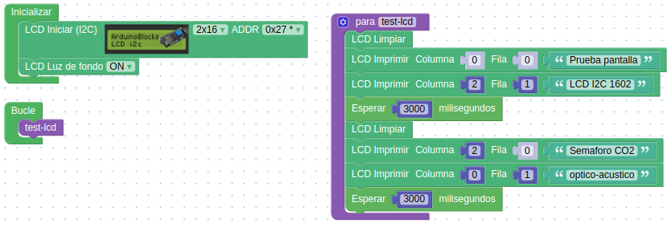 |
| Aspecto del programa en ArduinoBlocks |
| [Enlace al archivo para importar a ArduinoBlocks](../../modular/firmwares/ArduinoBlocks/test-LCD-I2C.abp) |
| [Enlace al archivo para trabajar desde el IDE de Arduino](../firmwares/ino/test-LCD-I2C.ino) |
| [Enlace a la librería necesaria para el IDE](../firmwares/librerias/ABlocks_LiquidCrystal_I2C.zip) |
 

En la imagen 2 vemos el resultado de cargar el programa en la placa UNO.

|Imagen 2 ||
|:-:|:-:|
| 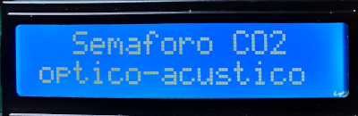 | 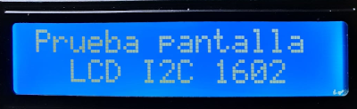 |
| Resultado prueba LCD, pantalla 1 | Resultado prueba LCD, pantalla 2 |

## Prueba sensor temperatura y humedad DHT22

Conectamos el sensor al pin digital D2 con el conector dupont hembra de 3 pines teniendo cuidado de que la orientación sea la correcta. Descargamos o creamos el programa similar a la imagen 3.

|Imagen 3 |
|:-:|
| 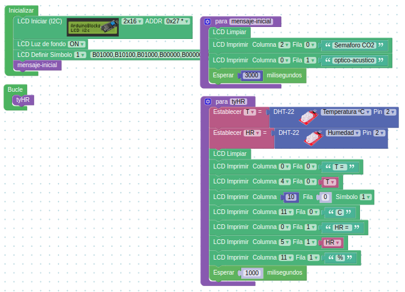 |
| Aspecto del programa en ArduinoBlocks |
| [Enlace al archivo para importar a ArduinoBlocks](../firmwares/ArduinoBlocks/Test-DHT22.abp) |
| [Enlace al archivo para trabajar desde el IDE de Arduino](../firmwares/ino/Test-DHT22.ino) |
| [Enlace a la librería necesaria para el IDE](../firmwares/librerias/ABlocks_LiquidCrystal_I2C.zip) |
| [Enlace a la librería necesaria para el IDE](../firmwares/librerias/ABlocks_DHT.zip) |
 

En la imagen 4 vemos las dos pantallas que nos presentará este programa de prueba.

|Imagen 4 ||
|:-:|:-:|
|  | 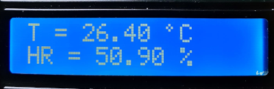 |
| Resultado prueba DHT22, pantalla 1 | Resultado prueba DHT22, pantalla 2 |

## Prueba interruptor de modo

Conectamos el actuador al pin digital 7 en su patilla central, a Vcc la patilla con la resistencia y a GND la que resta. En este caso la prueba la vamos a realizar con el sensor DHT22 mostrando o no la información del mismo según el modo elegido. Descargamos o creamos el programa similar a la imagen 5.

|Imagen 5 |
|:-:|
| 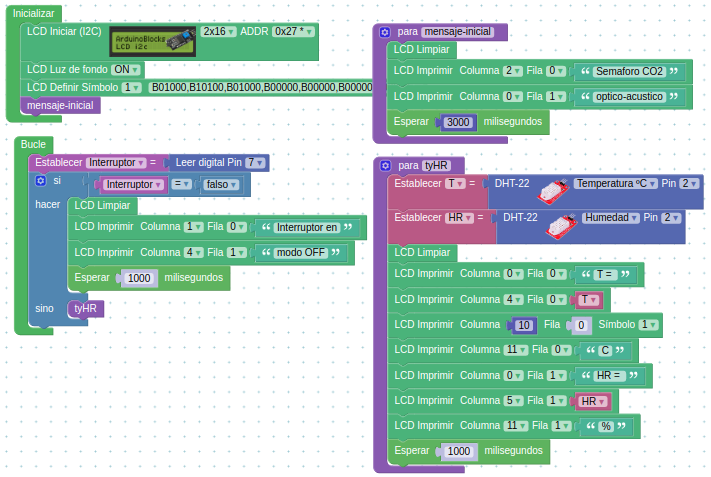 |
| Aspecto del programa en ArduinoBlocks |
| [Enlace al archivo para importar a ArduinoBlocks](../firmwares/ArduinoBlocks/Test-interruptor-modo.abp) |
| [Enlace al archivo para trabajar desde el IDE de Arduino](../firmwares/ino/Test-interruptor-modo.ino) |
| [Enlace a la librería necesaria para el IDE](../firmwares/librerias/ABlocks_LiquidCrystal_I2C.zip) |
| [Enlace a la librería necesaria para el IDE](../firmwares/librerias/ABlocks_DHT.zip) |
 

En la imagen 6 vemos las pantallas que nos presentará este programa de prueba.

|Imagen 6 ||
|:-:|:-:|
|  |  |
| Resultado prueba interruptor de modo, pantalla 1 | Resultado prueba interruptor de modo, pantalla 2 |
| 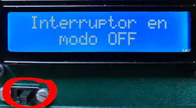 | 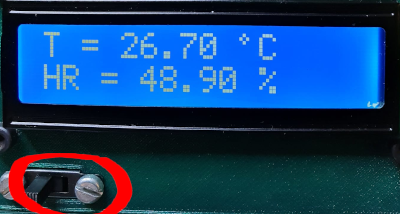 |
| Resultado prueba interruptor de modo, pantalla 3 | Resultado prueba interruptor de modo, pantalla 4 |

Observamos en la zona destacada en rojo la posición diferente del interruptor según el caso, a la derecha (modo off) y a la izquierda modo normal.

## Prueba del sensor de CO2 y VOC CCS811

Realizamos las conexiones del sensor a un conector del HUB I2C teniendo precaución de que cada pin esté en el lugar que le corresponde. Recordemos que este sensor va a tener un cable extra (wake) que lo mantiene despierto si lo conectamos a GND y también que debemos hacer un arreglo en el pin de *reset*, véase **Ñapa número 2** en Montaje y conexionado. El programa en ArduinoBlocks tiene el aspecto que vemos en la imagen 7.

Descargamos o creamos el programa.

|Imagen 7 |
|:-:|
| 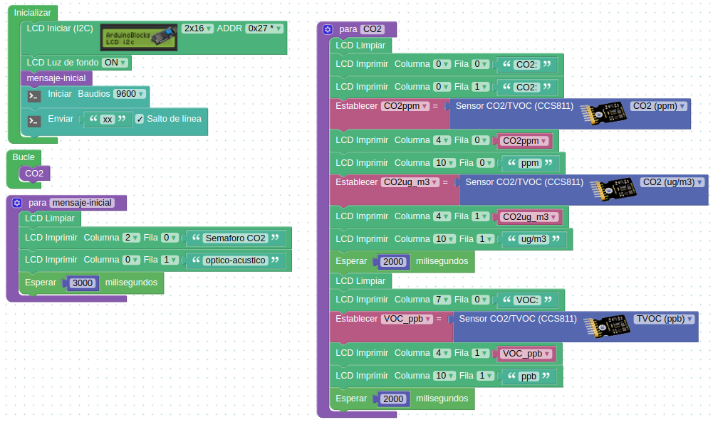 |
| Aspecto del programa en ArduinoBlocks |
| [Enlace al archivo para importar a ArduinoBlocks](../firmwares/ArduinoBlocks/Test-CCS811-CO2.abp) |
| [Enlace al archivo para trabajar desde el IDE de Arduino](../firmwares/ino/Test-CCS811-CO2.ino) |
| [Enlace a la librería necesaria para el IDE](../firmwares/librerias/ABlocks_LiquidCrystal_I2C.zip) |
 

En la imagen 8 vemos las pantallas que nos presentará este programa de prueba.

|Imagen 8 ||
|:-:|---|
|  | Resultado prueba sensor CCS811, pantalla 1 |
| 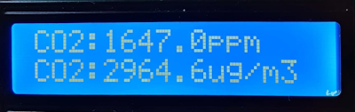 | Resultado prueba sensor CO2, pantalla 2 |
| 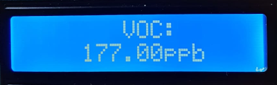 | Resultado prueba sensor VOC, pantalla 3 |

Durante estas pruebas hemos podido observar como los **niveles que marca el sensor se disparan a valores muy altos** en un entorno de solamente una persona respirando como a medio metro de distancia. Este comportamiento es debido a que, con todos los sensores metidos en un espacio pequeño, el aire ambiente en la zona de influencia del sensor se vicia y no se renueva con la asiduidad debida. También pone de manifiesto la necesidad de ventilar para mejorar los niveles de CO2. Tenemos que solucionar el problema sacando el sensor fuera de la caja de sensores. Explicamos seguidamente que vamos a hacer.

Una primera opción es colocar el sensor directamente fuera de la caja de sensores aprovechando para sujetarlo el agujerito de que dispone la tapa de sensores y un separador impreso junto con el tornillo y la tuerca apropiados. Esta opción es la mejor de cara al sensor pero deja expuesta toda la placa y según el sitio donde se use el dispositivo puede no ser muy conveniente. En la imagen 9 tenemos el detalle de ese orificio.

|Imagen 9 |
|:-:|
| 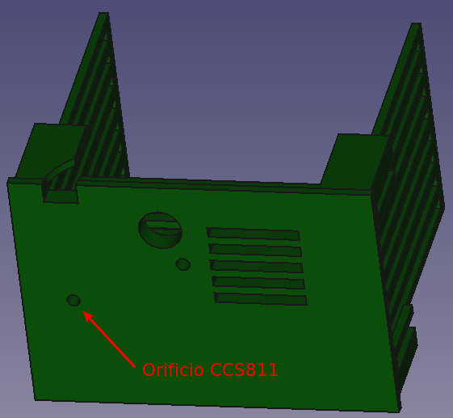 |
| Orificio para sujetar el sensor CCS811 |

Una segunda opción es situar el sensor en una pequeña caja como la que vemos en la imagen 10 donde irá alojado el sensor y la cajita irá pegada a la parte posterior de la tapa de sensores en la zona del agujero de la primera opción.

|Imagen 10 ||
|:-:|:-:|
| 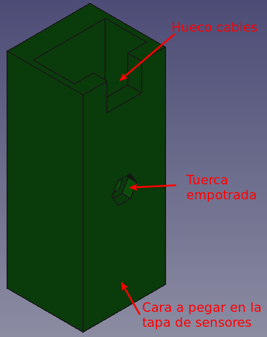 | 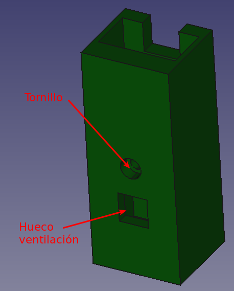 |
| Parte posterior caja CCS811 | Parte frontal caja CCS811 |

En la imagen 11 vemos la tapa de la caja del sensor CCS811.

|Imagen 11 |
|:-:|
| 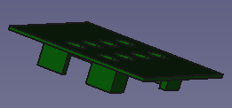 |
| Aspecto de la tapa |

En la imagen 12 vemos la caja ya colocada en su lugar y un detalle de la tapa.

|Imagen 12 ||
|:-:|:-:|
| 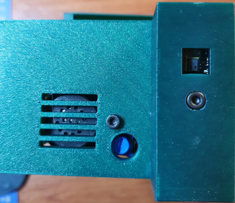 | 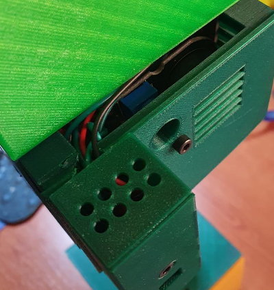 |
| Caja sensor CCS811 colocado en su lugar | Detalle de la tapa |

## Prueba de sonido

Conectamos el sensor de sonido (micrófono) al pin analógico A0 y el amplificador al pin digital 3 teniendo precaución de orientar correctamente los conectores. La prueba simple va a consistir en que el sistema esté en silencio hasta que no detecte un determinado nivel sonoro y cuando esto ocurra sonará durante unos instantes un fragmento del tema principal de Star Wars.

El programa en ArduinoBlocks tiene el aspecto que vemos en la imagen 13.

|Imagen 13 |
|:-:|
| 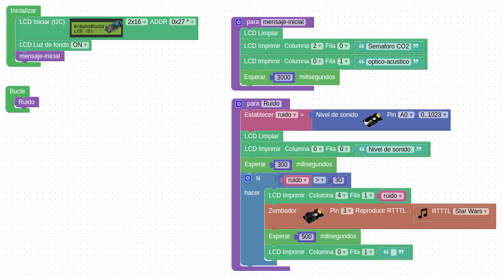 |
| Aspecto del programa en ArduinoBlocks |
| [Enlace al archivo para importar a ArduinoBlocks](../firmwares/ArduinoBlocks/Test-Sonido.abp) |
| [Enlace al archivo para trabajar desde el IDE de Arduino](../firmwares/ino/Test-Sonido.ino) |
| [Enlace a la librería necesaria para el IDE](../firmwares/librerias/ABlocks_LiquidCrystal_I2C.zip) |
| [Enlace a la librería necesaria para el IDE](../firmwares/librerias/ABlocks_TimerFreeTone.zip) |
 

En el [Enlace al video](https://youtu.be/omasQhij8FY) podemos observar el aspecto del programa de prueba así como su funcionamiento.

## Prueba de los diodos LED

Conectamos el LED que van en el color verde al pin digital D4, el que va en el amarillo al D5 y el que va en el rojo al D6. La prueba simple va a consistir en mostrar el mensaje de bienvenida y tras el mismo encender y apagar los tres colores en una secuencia verde-amarillo-rojo que se repite tres veces mostrando el color en la pantalla LCD.

El programa en ArduinoBlocks tiene el aspecto que vemos en la imagen 14.

|Imagen 14 |
|:-:|
| 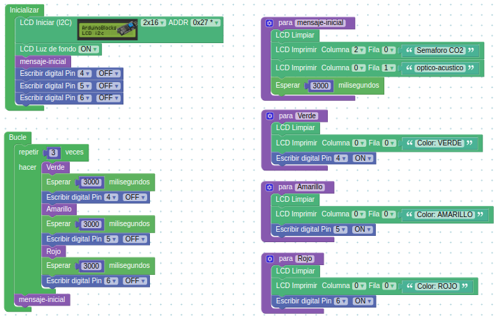 |
| Aspecto del programa en ArduinoBlocks |
| [Enlace al archivo para importar a ArduinoBlocks](../firmwares/ArduinoBlocks/Test-LEDs.abp) |
| [Enlace al archivo para trabajar desde el IDE de Arduino](../firmwares/ino/Test-LEDs.ino) |
| [Enlace a la librería necesaria para el IDE](../firmwares/librerias/ABlocks_LiquidCrystal_I2C.zip) |
 

En el [Enlace al video](https://youtu.be/vX_U4HDsH9I) podemos observar el aspecto del programa de prueba así como su funcionamiento.

## Prueba del barómetro BMP280

Conectamos el sensor a un conector del HUB I2C teniendo precaución de que cada pin esté en el lugar que le corresponde. Descargamos o creamos el programa similar a la imagen 15.

|Imagen 15 |
|:-:|
| 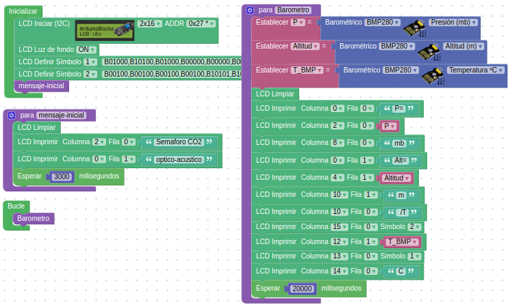 |
| Aspecto del programa en ArduinoBlocks |
| [Enlace al archivo para importar a ArduinoBlocks](../firmwares/ArduinoBlocks/Tet-BMP280.abp) |
| [Enlace al archivo para trabajar desde el IDE de Arduino](../firmwares/ino/Tet-BMP280.ino) |
| [Enlace a la librería necesaria para el IDE](../firmwares/librerias/ABlocks_LiquidCrystal_I2C.zip) |
 

En la imagen 16 vemos las dos pantallas que nos presentará este programa de prueba.

|Imagen 16 ||
|:-:|:-:|
|  | 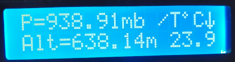 |
| Resultado prueba BMP280, pantalla 1 | Resultado prueba BMP280, pantalla 2 |

