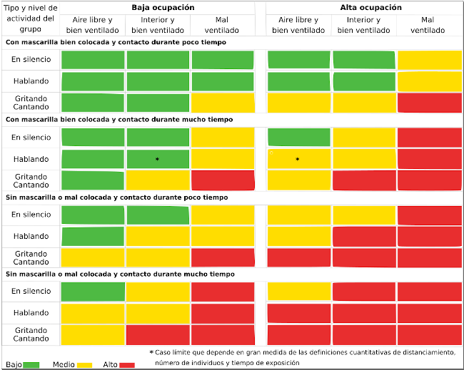

# Algunos conceptos sobre el CO2

El dióxido de carbono es un gas inodoro e incoloro. Bajo presión puede encontrarse en estado líquido o estado sólido (hielo seco). 

En el enlace podemos encontrar mas [definiciones de términos usuales](https://www.nj.gov/health/eoh/rtkweb/documents/fs/0343sp.pdf) dadas por el Departamento de Salud de New Jersey.

## Necesidad de vigilar los niveles de CO2

De manera muy resumida diremos que al respirar aire con mucho CO2, aumenta su concentración en sangre, baja el pH de la misma, y esto dispara la sensación de asfixia.

En la página 8 de la [Ficha Técnica de Seguridad número 300000000020](http://www.carburos.com/microsite/es/selector-gases-soldadura/pdf/SDS/CO2.pdf) se indican claramente los efecto perjudiciales del CO2 que relacionamos a continuación.

* **Efectos debido a la inhalación:**
    * Una concentración de CO2 superior o igual al 10% puede causar pérdida de consciencia o muerte.
    * El bióxido de carbono tiene la capacidad de provocar la muerte, incluso si se mantienen los niveles normales de oxígeno (20 a 21%).
    * El bióxido de carbono es fisiológicamente activo, afecta la circulación y la respiración.
    * A concentraciones de 2 a 10%, el bióxido de carbono puede ocasionar náusea, mareo, dolor de cabeza, confusión, aumento de la presión arterial y la frecuencia respiratoria.
    * A elevadas concentraciones puede causar asfixia.
    * Los síntomas pueden incluir la pérdida de la consciencia o de la movilidad.
    * La víctima puede no haberse dado cuenta de la asfixia. La asfixia puede causar la inconsciencia tan inadvertida y rápidamente que la víctima puede ser incapaz de protegerse.

* **Síntomas:**
    * Vértigo.
    * Salivación.
    * Náusea.
    * Vómitos.
    * Pérdida de movilidad/consciencia.
    * Escalofríos.
    * Sudor.
    * Visión borrosa.
    * Dolor de cabeza.
    * Aumento de pulsaciones.
    * Insuficiencia respiratoria.
    * Respiración rápida.

* **Toxicidad aguda por inhalación:** 
    * Un nivel de CO2 del 5% actúa de manera sinérgica e incrementa la toxicidad de otros gases (CO, NO2).
    * El CO2 incrementa la producción de carboxihemoglobina o metahemoglobina ocasionada por estos gases, probablemente debido a los efectos estimulantes del bióxido de carbono en los sistemas respiratorio y circulatorio.

Podemos consultar mas datos sobre el CO2 en la [Ficha de seguridad oficial](http://www.ilo.org/dyn/icsc/showcard.display?p_card_id=21&p_edit=&p_version=2&p_lang=es)

En la entrada Dióxido de carbono del Instituto para la Salud Geoambiental podemos leer:

> **Efectos en la salud:**

>> El principal efecto que produce el CO2 es la asfixia por desplazamiento del oxígeno, pero esto se produce por concentraciones muy altas capaces de desplazar el oxígeno y reducir su concentración por debajo del 20%. En concentraciones altas, cercanas a la 30.000 ppm, puede causar dolores de cabeza, falta de concentración, somnolencia, mareos y problemas respiratorios. En entornos laborales, como oficinas, se comienzan a tener quejas de olores a partir de las 800-1000 ppm.

> **Colegios y CO2**

>> Es importante señalar que las personas con problemas de asma o SQM deben proveerse de un aire con bajas concentraciones de CO2.

>> Un grupo a tener en cuenta especialmente son los niños en los colegios. En España **no hay** normativa que regule el nivel de CO2 en los colegios, como si lo tienen por ejemplo en Francia, y es bien conocida la relación entre el bajo rendimiento escolar y los altos niveles de CO2. Además los niños debido a su metabolismo y actividad producen mucho más CO2 que los adultos.

> **Principales Fuentes:**

>> La principal fuente en ambientes interiores es la respiración humana. Se deben considerar otras posibles fuentes debidas a combustión en casos de altos niveles de concentración.

> **Niveles habituales:**

>> Los niveles habituales que podamos encontrar en un ambiente interior estará relacionado con las diferentes variables que afectan a este factor como son: Niveles en aire exterior, fuentes interiores, niveles de ocupación y tasas de ventilación.

>> En la legislación existente no hay un valor concreto que se dé como bueno. Existen diferentes recomendaciones y valores límite ocupacionales. En el RITE por ejemplo en función del nivel de calidad de aire exigible al local los valores de concentración van desde las 400 ppm hasta más de 1.000 ppm. El valor límite de exposición profesional para exposiciones de 8 horas que vemos en las Guías del INSHT es de 5.000 ppm si bien este valor no se puede aplicar a entornos no industriales. Recordemos que en espacios como oficinas a partir de 800 ppm se producen quejas por olores y se recomienda no superar las 1.000 ppm.

>> Lo ideal es que el cociente entre exterior e interior sea lo más cercano a 1 posible.

En el artículo de la [International Journal of Emergency Medicine](https://intjem.biomedcentral.com/articles/10.1186/s12245-017-0142-y) dado en la webgrafía se pueden consultar mas datos relativos al tema del CO2 y en el de Centro Canadiense de Seguridad y Salud Ocupacional [(CCSSO)](http://www.ccsso.ca/oshanswers/chemicals/chem_profiles/carbon_dioxide/health_cd.html) tenemos respuestas a diversas cuestiones sobre el CO2.

## Riesgos de transmisión de covid-19 en distintas situaciones

En la figura 3 del artículo Editorial de BMJ dado en la webgrafía podemos leer que la gráfica exponer el ***Riesgo de transmisión del SARS-CoV-2 de personas asintomáticas en diferentes entornos y para diferentes tiempos de ocupación, ventilación y niveles de hacinamiento (ignorando la variación en la susceptibilidad y las tasas de diseminación viral). Las calificaciones son indicativas de riesgo relativo cualitativo y no representan una medida cuantitativa. Es posible que también deban tenerse en cuenta otros factores no presentados en estas tablas al considerar el riesgo de transmisión, incluida la carga viral de una persona infectada y la susceptibilidad de las personas a la infección. Toser o estornudar, incluso si se deben a irritación o alergias mientras esté asintomático, agravaría el riesgo de exposición en un espacio interior, independientemente de la ventilación.***

Reproducimos aquí la gráfica en formato original traducida para que nos sirva de guía en los mensajes que van apareciendo en la pantalla LCD relacionados con los colores que va adquiriendo el semáforo.

| Imagen 1 |
|:-:|
|  |
| Gráfica de riesgos de transmisión |

El archivo fuente en formato svg está disponible para descargar [aquí](../img/sobre-co2/i1.svg) y en formato pdf [aquí](../img/sobre-co2/i1.pdf)
